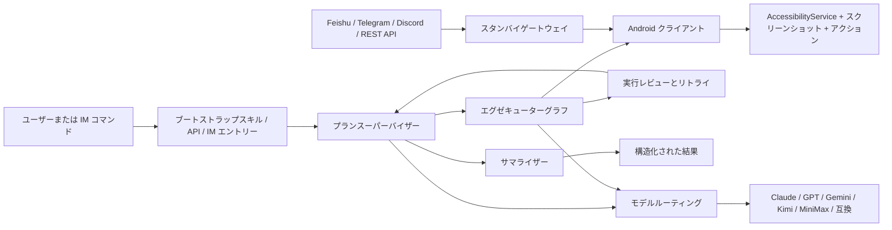

<p align="center">
  <strong>言語:</strong> <a href="./README.md">English</a> | <a href="./README.zh-CN.md">简体中文</a> | <a href="./README.ja-JP.md">日本語</a>
</p>

<p align="center">
  
</p>

<p align="center">
  <a href="./skills/open-gui-bootstrap/SKILL.md"></a>
  
  
  
  <a href="./docs/get-started.md"></a>
</p>

<p align="center">
  <strong>Android 向けのモバイル GUI エージェントフレームワーク。</strong>
</p>

<p align="center">
  OpenGUI は、AI エージェントが実機上の Android アプリ UI を見て、理解し、操作できるようにします。
</p>

## Demo

<p align="center">
  
</p>

OpenGUI は実際の Android アプリ UI を読み取り、次のステップを計画し、モバイル操作を実行して、構造化された結果を返します。

## Quick Start

OpenGUI を最も早く試す方法は、Claude Code または Codex にブートストラップを任せることです。

```text
Read ./skills/open-gui-bootstrap/SKILL.md and help me run OpenGUI. Only ask me for phone-side actions.
```

必要なもの:

- Android スマートフォンまたはエミュレーター
- USB デバッグの有効化
- AccessibilityService の有効化
- 実際のタスク実行に使うモデル API キー

OpenGUI はリポジトリ内のスクリプトを使ってバックエンドを起動し、Android クライアントをインストールします:

```bash
cd server
./start.sh
```

```bash
cd client
./start.sh
```

バックエンドと Android クライアントが起動したら、最初のタスクを送信します:

```bash
cd server
pnpm opengui -- devices --json
pnpm opengui -- do "Observe the current Android screen and summarize what you see" --json
```

手動セットアップガイド: [`docs/get-started.md`](./docs/get-started.md)

## 最近の更新

- `[2026.5.16]` [Codex / Claude Code リモートコントロール](./docs/codex-remote-control.zh-CN.md)を追加しました。ローカル REST API、`pnpm opengui -- ...` CLI、[`open-gui-remote-control`](./skills/open-gui-remote-control/SKILL.md) Skill により、コーディングエージェントから Android アプリタスクをディスパッチできます。
- `[2026.5.9]` [Discord IM エントリー](./docs/DISCORD.ja-JP.md)を追加しました。プレフィックスコマンド、スラッシュコマンド、allowlist、guild 単位のコマンド登録に対応し、Discord チャンネルから Android タスクをリモート実行できます。
- `[2026.5.7]` Docker ベースのバックエンド起動時に、一般的な PostgreSQL / Redis ポート競合を避けられるようローカル起動フローを強化しました。
- `[2026.5.1]` バックエンドのオンボーディングとして、`.env.example`、起動時チェック、graph agent 向け VLM 環境変数設定を整備しました。

## OpenGUI でできること

OpenGUI は、AI が実際の Android スマートフォンを操作できるようにするシステムです。

このリポジトリは4つの実用的な方法で利用できます:

- **主要な Android アプリを操作**: X、Reddit、Hacker News、Telegram、WeChat、Weibo、小紅書などの Android アプリ上で、AI にモバイルタスクを実行させることができます。
- **組み込みワークフローを実行**: バックエンド、Android クライアント、スタンバイディスパッチパス、組み込みタスク機能一式がすぐに実行可能な状態で含まれています。
- **Claude や Codex にブートストラップさせる**: [`skills/open-gui-bootstrap/SKILL.md`](./skills/open-gui-bootstrap/SKILL.md) をモデルに指示し、目的を自然言語で説明すれば、セットアップ、ビルド、インストール、ローカルデバッグをモデルが処理します。
- **Codex で Android アプリを操作**: OpenGUI の起動後、[`skills/open-gui-remote-control/SKILL.md`](./skills/open-gui-remote-control/SKILL.md) を Codex または Claude Code に渡すと、ローカル CLI 経由でデバイス一覧、タスクディスパッチ、execution 状態確認ができます。
- **リモートワーカーとしてスマートフォンを操作**: Feishu、Telegram、Discord、REST API 経由でタスクをディスパッチし、デバイスをスタンバイ状態に保ち、バックエンドから構造化された結果を受け取ることができます。

## 特徴

- **長時間タスク向けに設計**: OpenGUI は、数時間に及ぶモバイルワークフローに対応しており、進捗、レビュー、リカバリーをシステム内で管理します。
- **実行前に計画し、実行後に要約**: OpenGUI はアプリを操作する前に目標を実行可能な手順へ分解し、実行後には何が起きたか、何が成功したか、何に注意が必要かを構造化して返します。
- **タスクの継続実行**: `Plan Supervisor` がタスクの状態と継続を管理し、`Executor Graph` がスクリーンショット、ビジョン、アクション、ユーザー呼び出しのループをデバイスのリアルタイム状態上で実行し、`Summarizer` が構造化された結果で実行を完了します。
- **スタンバイ待機**: スタンバイディスパッチパスにより、Feishu、Telegram、Discord、REST エントリーポイントを通じてデバイスがリモートワークを受信できます。
- **ロール別のモデル割り当て**: モデルルーティングにより、プランニングと VLM 実行を分離し、チームがジョブごとにプロバイダーを選択できます。
- **実際のモバイルワークフローに基づいた設計**: グラフ、デバイス実行パス、モデル分割がソースツリーに組み込まれています。

## OpenGUI が異なる理由

OpenGUI は、明示的なオーケストレーションレイヤーを持つモバイルオペレーターシステムとして構築されています。

ソースコードは現在、以下のコンポーネントを公開しています:

- `server/apps/backend/src/modules/graph-agent/graph/mobile-agent.graph.ts` — メイングラフ
- `server/apps/backend/src/modules/graph-agent/graph/executor.graph.ts` — デバイス側の実行ループ
- `server/apps/backend/src/common/ws/standby.gateway.ts` — スタンバイデバイスディスパッチ
- `client/core_network/.../StandbySocketManager.kt` — 永続的なデバイススタンバイ接続
- `client/core_accessibility/.../GestureService.kt` — Android 側のアクション実行

| 観点 | 一般的なスマホエージェントデモ | OpenGUI |
|---|---|---|
| **実行モデル** | 短いインタラクティブループ | メイングラフ + エグゼキューターサブグラフ |
| **タスク状態** | 通常ローカルでセッション単位 | バックエンドグラフでタスク状態を管理 |
| **デバイスパス** | 多くの場合ノートPC主導の制御 | スタンバイ・実行ソケット付きの Android クライアント |
| **モデル使用** | 1つのモデルがほぼ全てを処理 | プランニングと VLM パスをプロバイダー間で分割可能 |
| **リモート操作** | オプションのアドオン | Feishu、Telegram、Discord、REST API、スタンバイディスパッチがバックエンドに組み込み済み |

## 代表的なユースケース

- X を開いてトピックに関する最近の投稿を収集する
- 実機で Reddit や Hacker News のスレッドを読んで要約する
- Feishu、Telegram、Discord、REST API から Android タスクをリモートでトリガーする
- Android デバイス上で反復的なモバイルワークフローを実行する
- 状態管理、レビュー、リカバリーが必要な長時間モバイルワークフローを実行する

## 現在の制限

- Android 実機またはエミュレーターが必要です。
- USB デバッグと AccessibilityService 権限が必要です。
- 実行品質は、モデル、アプリ UI、ネットワーク状態、タスクの長さに依存します。
- 現時点では OS レベルの常駐アシスタントではありません。タスクは手動、または設定済みのディスパッチ経路から起動します。
- 長時間タスクはシステム設計上サポートされていますが、信頼性にはさらに実環境での検証が必要です。
- すぐに実行できるタスク例と benchmark は今後さらに追加する必要があります。

## Roadmap

- 短い Demo 動画と実アプリ例を追加する。
- ローカルセットアップをより一コマンドに近づける。
- すぐに実行できる phone-use タスクテンプレートを増やす。
- 実行リカバリーと失敗レポートを改善する。
- Android GUI Agent の信頼性 benchmark タスクを追加する。
- モデル設定とコスト削減プロファイルのドキュメントを拡充する。

## OpenGUI の使い方

### 1. Claude や Codex を使う場合

[`skills/open-gui-bootstrap/SKILL.md`](./skills/open-gui-bootstrap/SKILL.md) から始めてください。

手順はシンプルです:

1. Claude または Codex にスキルを指示する
2. タスクを自然言語で説明する
3. バックエンドのブートストラップ、APK ビルド、インストール、ローカルデバッグをモデルに任せる

以下の場合のみ操作が必要です:

- スマートフォンの接続またはエミュレーターの起動
- USB デバッグの承認
- AccessibilityService の有効化
- オーバーレイまたはバッテリー権限の付与
- API キーまたはボット認証情報の入力

バックエンドと Android client が起動したら、[`skills/open-gui-remote-control/SKILL.md`](./skills/open-gui-remote-control/SKILL.md) を使って Codex または Claude Code にローカル CLI 経由でスマートフォンを操作させることができます:

```bash
cd server
pnpm opengui -- devices --json
pnpm opengui -- do "Observe the current Android screen and summarize what you see" --json
pnpm opengui -- status <executionId> --json
```

推奨プロファイル:

#### ハイパフォーマンスプロファイル

プランニング、監視、レビュー、ビジョンのすべてに最新の Claude Opus モデルファミリーを使用し、最高の実行品質を求める場合に推奨します。

最も簡単に最高の実行品質を得られる方法ですが、最もコストが高いパスです。

#### コスト削減ミックスプロファイル

Planner と Supervisor などのテキスト側ロールには **Qwen 3.6 Plus** を使用し、VLM 側には **Doubao Pro** を使用します。

タスクの長さ、スクリーンショット量、トークンミックスにもよりますが、全 Opus 構成と比較してモデルコストを約 **10倍〜15倍** 削減できることが多いです。

推奨プロンプト:

#### 実行する

```text
Read ./skills/open-gui-bootstrap/SKILL.md and help me run OpenGUI. Only ask me for phone-side actions.
```

#### Claude Opus をすべてに使用する

```text
Read ./skills/open-gui-bootstrap/SKILL.md and bootstrap OpenGUI with the latest Claude Opus model family for planning, supervision, review, and vision.
```

#### Qwen + Doubao でコスト削減する

```text
Read ./skills/open-gui-bootstrap/SKILL.md and set up OpenGUI with Qwen 3.6 Plus for Planner and Supervisor, and Doubao Pro for VLM execution.
```

#### 自分の API を使用する

```text
Read ./skills/open-gui-bootstrap/SKILL.md and use my existing model APIs to get OpenGUI working.
```

### 2. 手動セットアップ

リポジトリのスクリプトを直接使用します:

```bash
cd server
./start.sh
```

```bash
cd client
./start.sh
```

参考ドキュメント:

- [docs/get-started.md](./docs/get-started.md)
- [server/start.sh](./server/start.sh)
- [client/start.sh](./client/start.sh)
- [server/apps/backend/README.md](./server/apps/backend/README.md)
- [docs/DISCORD.ja-JP.md](./docs/DISCORD.ja-JP.md)
- [client/README.md](./client/README.md)

### 3. 任意の Discord リモートコントロール

Discord は任意の IM チャンネルとして有効化できます。Discord Bot が
`!opengui devices` や `!opengui do ...` などのコマンドを受け取り、バックエンドが
スタンバイ中の Android 端末へタスクをディスパッチし、進捗を同じチャンネルに
投稿します。

ローカル利用には必須ではありません。`DISCORD_BOT_TOKEN` が空の場合、バックエンド
は通常どおり起動し、Discord をスキップします。

詳細な設定手順: [docs/DISCORD.ja-JP.md](./docs/DISCORD.ja-JP.md)。

## システム構成



### コアランタイムコンポーネント

- **バックエンドグラフ**: `server/apps/backend/src/modules/graph-agent/graph/`
- **タスク API**: `server/apps/backend/src/modules/task/task.controller.ts`
- **スタンバイディスパッチ**: `server/apps/backend/src/common/ws/standby.gateway.ts`
- **IM チャンネルディスパッチ**: `server/apps/backend/src/modules/im-channel/`
- **Android スタンバイ接続**: `client/core_network/src/main/java/com/coremate/opengui/network/websocket/StandbySocketManager.kt`
- **Android 実行パス**: `client/core_accessibility/src/main/java/com/coremate/opengui/accessibility/GestureService.kt`

## ドキュメント

- [skills/open-gui-bootstrap/SKILL.md](./skills/open-gui-bootstrap/SKILL.md)
- [docs/get-started.md](./docs/get-started.md)
- [server/apps/backend/README.md](./server/apps/backend/README.md)
- [docs/DISCORD.ja-JP.md](./docs/DISCORD.ja-JP.md)
- [client/README.md](./client/README.md)
- [CONTRIBUTING.md](./CONTRIBUTING.md)
- [SECURITY.md](./SECURITY.md)
- [CLAUDE.md](./CLAUDE.md)

## コミュニティ / サポート

特に有用なプロジェクトフィードバック:

- バグや機能リクエストの Issue を作成する
- 実際のユースケースやデプロイメントのフィードバックを共有する
- ドキュメント、インテグレーション、修正のコントリビューション

## ライセンス

OpenGUI は Business Source License 1.1 (BUSL-1.1) の下でソース公開されています。

非本番目的でのソースのコピー、修正、配布、使用が可能です。本番使用、商用使用、ホスティングサービス、商用製品への統合には、Core-Mate からの別途商用ライセンスが必要です。

このバージョンについて:

- 変更日: 2030-04-29
- 変更ライセンス: Apache License, Version 2.0

変更日まではパブリックソースですが、OSI 認定のオープンソースではありません。

[LICENSE](./LICENSE) を参照してください。
