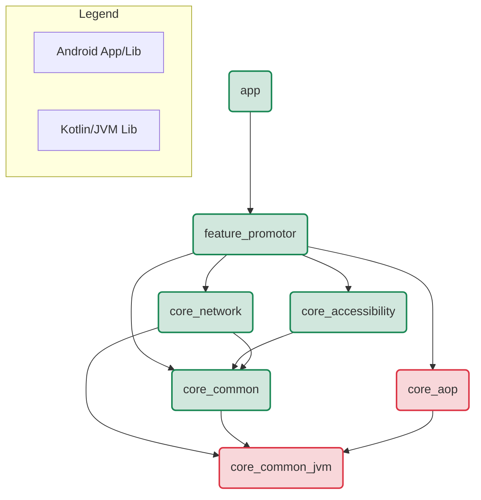

# Haomai Promotor (自动化营销产品)

赋能营销人员，通过高度可定制化的自动化脚本与UI交互，实现高效、精准的用户触达与增长。

## ✨ 项目愿景

本产品旨在打造一个强大的自动化营销工具，它能够模拟真人操作，在各种应用中执行预设的营销任务（如内容发布、用户互动等），从而解放人力，实现规模化、数据驱动的营销策略。

## 🏗️ 架构概览

为支撑产品的稳定性与未来扩展性，项目采用了分层和功能模块化的Clean Architecture思想。模块间的依赖关系如下：

## 🛠️ 技术栈

- **语言**: Kotlin
- **异步处理**: Kotlin Coroutines & Flow
- **架构模式**: MVVM, Unidirectional Data Flow (UDF), Clean Architecture
- **UI**: Android Views, Material Design, ViewBinding
- **网络**: Retrofit, OkHttp, Socket.IO-Client-Java
- **自动化**: Android Accessibility Service API
- **元编程**: KSP (Kotlin Symbol Processing)
- **依赖管理**: Gradle Version Catalog (libs.versions.toml)

## 📦 模块详解

#### `:app`
- **类型**: Android Application
- **职责**: 应用的入口和“外壳”。负责组装所有模块，并进行全局初始化（如日志系统）。

#### `:feature_promotor`
- **类型**: Android Library
- **职责**: 核心业务功能模块，包含所有用户直接交互的界面 (`Fragment`) 和对应的业务逻辑 (`ViewModel`)。

#### `:core_common_jvm`
- **类型**: **Kotlin/JVM Library**
- **职责**: **项目最底层**。提供纯粹的、不依赖任何Android平台的接口、数据模型和工具。
- **主要组件**:
    - `Logger.kt` (日志接口)
    - `Constants.kt` (全局常量)
    - 数据传输对象 (DTOs), 业务模型 (Models)

#### `:core_common`
- **类型**: Android Library
- **职责**: 提供**依赖Android SDK**的通用工具，以及对 `core_common_jvm` 中接口的Android平台实现。
- **主要组件**:
    - `AndroidLogger.kt` (`Logger`接口的安卓实现)
    - `BaseViewModel.kt`, `UiState.kt` (状态管理)
    - 需要 `Context` 的工具类, `View`的扩展函数等。
- **依赖**: `:core_common_jvm`

#### `:core_network`
- **类型**: Android Library
- **职责**: 负责所有网络通信。
- **主要组件**:
    - `RetrofitClient`, `SocketManager`
- **依赖**: `:core_common` (用于需要Context的拦截器), `:core_common_jvm` (用于数据模型)。

#### `:core_aop`
- **类型**: **Kotlin/JVM Library**
- **职责**: 提供AOP的基础能力。它是一个纯JVM模块，使其逻辑可以在非安卓环境（如单元测试）中复用。
- **主要组件**:
    - AOP注解, `AopWrappers.kt` (包装器), `ConsoleLogger.kt`
- **依赖**: `:core_common_jvm` (用于依赖`Logger`接口)。

#### `:core_accessibility`
- **类型**: Android Library
- **职责**: 封装所有UI自动化相关的能力。
- **主要组件**:
    - `GestureService`, `actions`, `capture`
- **依赖**: `:core_common`。

## 📝 日志策略 (Logging Strategy)

项目采用**依赖倒置原则**来处理日志。
1.  在 `:core_common_jvm` 中定义一个通用的 `Logger` 接口。
2.  在 `:core_common` (安卓环境) 中提供使用 `android.util.Log` 的 `AndroidLogger` 实现。
3.  在 `:core_aop` (纯JVM环境) 中提供使用 `println` 的 `ConsoleLogger` 实现。
4.  在应用启动时 (`PromotorApplication`)，将 `AndroidLogger` 实例注入为全局日志处理器，供所有模块统一调用。
