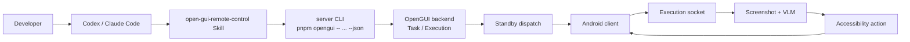

# 用 Codex 控制 Android 手机

OpenGUI 让 Codex / Claude Code 可以把自然语言任务交给一台真实 Android 手机执行。Codex 不直接点坐标，也不直接处理 Android socket 协议；它通过 OpenGUI 后端创建任务，后端再把执行请求交给在线的 Android client。

## 整体链路

Codex / Claude Code 是入口，OpenGUI backend 负责保存任务和执行状态，Android client 负责截图、动作执行和设备侧状态回传。任务进入后端之后，会通过 standby 连接发送到手机在线设备，再进入 execution socket 的执行循环。



`task` 是任务定义，描述要做什么。`execution` 是一次具体执行，一个 task 可以运行多次，每次运行都会生成新的 `executionId`。`do` 命令创建 task 并立刻创建 execution；`run <taskId>` 复用已有 task 并创建新的 execution；`status <executionId>` 查询某次执行的状态。

## Skill 边界

`open-gui-bootstrap` 用来启动 OpenGUI。它负责仓库检查、依赖安装、后端启动、Android client 构建安装、`adb reverse` 和模型配置。

`open-gui-remote-control` 用来控制已经接入 OpenGUI 的手机。它负责设备发现、任务创建、任务运行、状态查询、暂停、恢复和取消。

从空环境开始时，先用 bootstrap。后端已启动、Android client 已安装并在线时，直接用 remote control。

## 运行环境

本地手机控制应运行在连接 Android 手机的开发机上。这个环境需要能运行 Node.js 22、pnpm、Docker、Java 和 adb，并且已经拿到 OpenGUI 仓库：

```text
https://github.com/Core-Mate/open-gui
```

可运行的 OpenGUI 仓库包含：

```text
server/package.json
client/start.sh
```

Android 侧需要完成 USB debugging 授权，并为 OpenGUI App 开启 Accessibility Service 和悬浮窗权限。使用 USB 连接本机后端时，需要建立端口反向代理：

```bash
adb reverse tcp:7777 tcp:7777
```

后端默认地址是：

```text
http://localhost:7777
```

后端需要先可访问，Android client 才能稳定建立 standby 连接。Android client 已安装时，保持 App 打开即可，不需要重新构建。

远端运行只适合设备桥接已经配置好的场景。普通 USB 手机控制不适合把 backend 放到远端，因为 USB debugging、APK 安装和 `adb reverse` 都发生在连接手机的本机环境里。

## 使用方式

OpenGUI 已经启动时，把下面这段交给 Codex / Claude Code：

```text
Read ./skills/open-gui-remote-control/SKILL.md and use OpenGUI to control my Android phone.
Task: 观察当前手机屏幕，简要描述你看到了什么，然后结束。
Only ask me for phone-side permissions or missing secrets.
```

OpenGUI 还没有启动时，先让 agent 执行 bootstrap，再进入 remote control：

```text
Read ./skills/open-gui-bootstrap/SKILL.md first to start OpenGUI.
Then read ./skills/open-gui-remote-control/SKILL.md and run this phone task:
观察当前手机屏幕，简要描述你看到了什么，然后结束。
```

Skill 会优先使用仓库里的 CLI。对应的本地命令是：

```bash
cd server
pnpm opengui -- devices --json
pnpm opengui -- do "观察当前手机屏幕，简要描述你看到了什么，然后结束" --json
pnpm opengui -- status <executionId> --json
```

多台设备在线时，先读取设备列表，再指定目标设备：

```bash
pnpm opengui -- devices --json
pnpm opengui -- do "打开设置，检查当前网络状态" --device <deviceId> --json
```

后端不在默认地址时，显式传入 base URL：

```bash
pnpm opengui -- devices --base-url <url> --json
```

`--json` 用于给 Codex / Claude Code 返回结构化结果，方便读取 `deviceId`、`taskId`、`executionId` 和 execution 状态。

## 执行模型

OpenGUI 不走坐标脚本。`adb shell input tap` 只能点固定坐标，不知道当前屏幕内容，也不知道任务执行到了哪一步。权限弹窗、登录页、网络加载、推荐浮层和系统中断都会让坐标脚本失效。

OpenGUI 的执行状态保存在后端。Android client 上传截图和设备状态，VLM 理解屏幕并生成下一步动作，Android AccessibilityService 负责执行动作。Codex / Claude Code 只需要通过 CLI 或 REST API 观察 execution 状态，并在需要时暂停、恢复或取消任务。

## 故障处理

仓库路径不对时，检查当前目录或子目录是否存在 `server/package.json` 和 `client/start.sh`。如果不存在，使用 `https://github.com/Core-Mate/open-gui` 获取可运行仓库。

`devices` 返回空时，检查 Android client 是否连上 backend：backend 是否运行，手机是否打开 OpenGUI App，USB debugging 是否授权，`adb reverse tcp:7777 tcp:7777` 是否执行，Accessibility Service 和悬浮窗权限是否开启。

`fetch failed` 表示 CLI 没有连上 backend。先访问 `http://localhost:7777/docs`；后端运行在其他地址时，用 `--base-url <url>`。

远端 backend 默认不能控制本地 USB 手机。本地手机通过 USB 和 `adb reverse` 连接的是本机环境。只有手机能访问远端 backend，并且设备连接链路已经配置好时，远端运行才成立。
