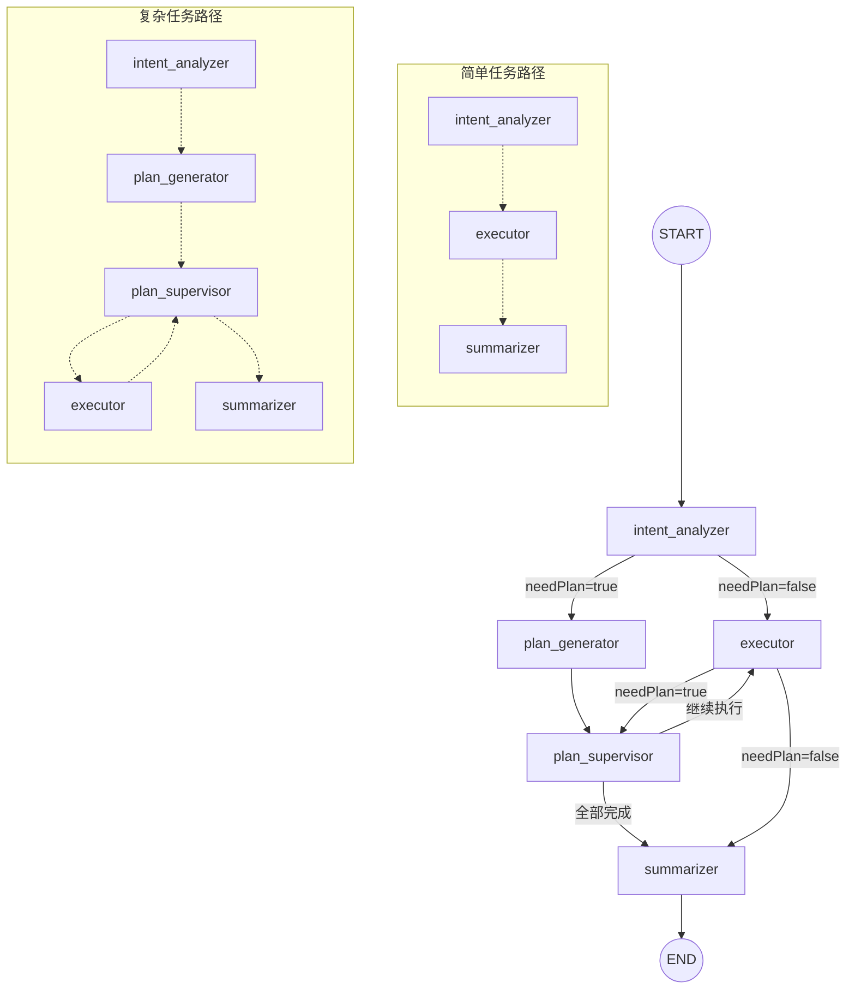
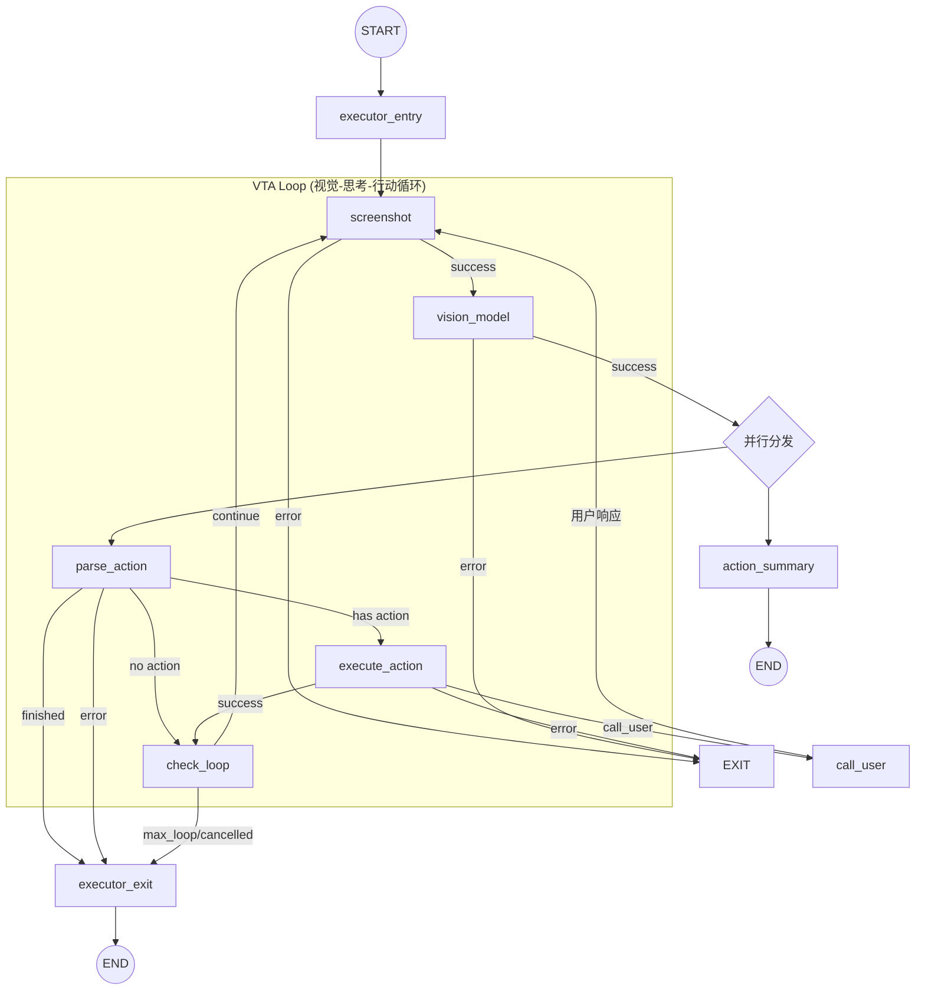

# CoreMate Backend

基于 NestJS + LangGraph 构建的 AI 移动端代理系统后端服务。

## 项目概述

CoreMate Backend 是一个智能移动设备自动化代理系统，通过多 Agent 协作完成复杂的移动端操作任务。系统基于 LangGraph 构建状态图，实现了任务规划、执行、监督和总结的完整工作流。

## 技术栈

- **框架**: NestJS 11 + Express
- **AI 框架**: LangGraph + LangChain
- **数据库**: PostgreSQL + Prisma ORM
- **缓存/队列**: Redis + BullMQ
- **实时通信**: Socket.IO + SSE

## 快速开始

```bash
# 安装依赖
pnpm install

# 开发模式
pnpm dev

# 生产构建
pnpm build
pnpm start:prod
```

## 配置与远程任务入口

后端配置文件使用 `server/apps/backend/.env`。第一次启动前可以从示例文件复制：

```bash
cp .env.example .env
```

基础运行至少需要 PostgreSQL、Redis 和模型配置。未配置 IM 机器人时，后端会正常启动，只跳过对应入口。

### Graph Agent 模型配置

OpenGUI 后端的 graph agents 使用 OpenAI-compatible 的模型接口。当前统一通过 `.env` 里的 `VLM_*` 变量配置：

```env
VLM_API_KEY=
VLM_BASE_URL=https://dashscope.aliyuncs.com/compatible-mode/v1
VLM_MODEL=qwen3.6-plus
```

这组配置会被规划、监督、总结和 executor VLM 路径共用。也就是说，变量名虽然叫 `VLM_*`，但它不只影响视觉执行节点，也会影响 graph agent 的文本侧模型调用。

说明：

- `VLM_API_KEY`：模型服务 API key，执行真实任务前必须配置。
- `VLM_BASE_URL`：OpenAI-compatible endpoint。使用 OpenAI 默认接口时可以按实际 provider 配置。
- `VLM_MODEL`：模型名，例如 `qwen3.6-plus` 或你的 provider 支持的其他模型。
- 后端可以在缺少这些值时启动，但任务执行到模型调用时会失败。

### Discord 入口

Discord Bot 可以作为远程任务入口：用户在 Discord 频道里发送命令，后端创建或执行 OpenGUI 任务，再把任务下发给已经待命的 Android 手机。

支持两种命令形式：

```text
!opengui help
!opengui devices
!opengui do open browser and search OpenGUI
```

```text
/opengui help
/opengui devices
/opengui do task:open browser and search OpenGUI
```

需要在 `.env` 中配置：

```env
DISCORD_BOT_TOKEN=
DISCORD_CLIENT_ID=
DISCORD_ALLOWED_GUILD_IDS=
DISCORD_ALLOWED_CHANNEL_IDS=
DISCORD_ALLOWED_USER_IDS=
DISCORD_COMMAND_PREFIX=!opengui
DISCORD_REGISTER_COMMANDS=false
```

安全建议：

- 生产或团队测试环境建议至少配置 `DISCORD_ALLOWED_GUILD_IDS` 和 `DISCORD_ALLOWED_CHANNEL_IDS`。
- 前缀命令需要在 Discord Developer Portal 打开 **Message Content Intent**。
- Slash 命令建议保持 guild-scoped 注册，并只在需要更新命令时设置 `DISCORD_REGISTER_COMMANDS=true`。

完整配置步骤见 [../../../DISCORD.zh-CN.md](../../../DISCORD.zh-CN.md)。

---

## Agent Graph 架构

系统采用 **LangGraph 双层图架构**，包含一个主图（Mobile Agent Graph）和一个子图（Executor Graph）。

### 整体架构概览

```
┌─────────────────────────────────────────────────────────────────────────────┐
│                          Mobile Agent Graph (主图)                           │
├─────────────────────────────────────────────────────────────────────────────┤
│                                                                             │
│    START ──▶ intent_analyzer                                                │
│                    │                                                        │
│         ┌─────────┴─────────┐                                               │
│         │                   │                                               │
│    needPlan=false      needPlan=true                                        │
│         │                   │                                               │
│         │            plan_generator                                         │
│         │                   │                                               │
│         │            plan_supervisor ◀─────────────────────┐                │
│         │                   │                              │                │
│         │            ┌──────┴──────┐                       │                │
│         │            │             │                       │                │
│         │      继续执行         全部完成                    │                │
│         │            │             │                       │                │
│         │            ▼             │                       │                │
│         └───▶ ┌──────────────┐     │                       │                │
│               │   executor   │─────┼───────────────────────┘                │
│               │   (子图)     │     │        (返回评估结果)                   │
│               └──────────────┘     │                                        │
│                      │             │                                        │
│              needPlan=false        │                                        │
│                      │             │                                        │
│                      ▼             ▼                                        │
│                  summarizer ◀──────┘                                        │
│                      │                                                      │
│                     END                                                     │
│                                                                             │
└─────────────────────────────────────────────────────────────────────────────┘
```

### 主图流程 (Mermaid)



---

## 主图节点详解

### 1. Intent Analyzer (意图分析器)

**文件位置**: `src/modules/graph-agent/graph/nodes/intent.node.ts`

**职责**: 分析用户输入，判断任务复杂度

| 输入 | 输出 | 模型 |
|------|------|------|
| `userInput` | `needPlan: boolean` | Claude (结构化输出) |

**决策逻辑**:
- `needPlan=true`: 复杂任务，需要先规划再执行
- `needPlan=false`: 简单任务，直接进入 Executor 执行

**路由结果**:
```
needPlan=true  → plan_generator
needPlan=false → executor (同时设置 executorInput.instruction = userInput)
```

---

### 2. Plan Generator (计划生成器)

**文件位置**: `src/modules/graph-agent/graph/nodes/plan-generator.node.ts`

**职责**: 为复杂任务生成详细的执行计划文档

| 输入 | 输出 | 模型 |
|------|------|------|
| `userInput` | `planDocument: string (Markdown)` | Claude (带 thinking) |

**特性**:
- 使用知识库工具 (`knowledgeToolService`) 检索相关文档
- 流式输出计划内容，通过 SSE 实时推送给客户端
- 支持 Extended Thinking 模式，输出推理过程

**路由结果**:
```
完成后 → plan_supervisor (固定边)
```

---

### 3. Plan Supervisor (计划监督器)

**文件位置**: `src/modules/graph-agent/graph/nodes/plan-supervisor.node.ts`

**职责**: 解析计划文档，管理任务列表，协调执行流程

| 输入 | 输出 | 模型 |
|------|------|------|
| `planDocument`, `executorOutput` | `current_sub_task`, `total_complete` | Claude (结构化输出) |

**核心功能**:
1. **首次调用**: 解析 `planDocument`，生成结构化任务列表
2. **后续调用**: 根据 `executorOutput` 评估执行结果，决定下一步

**决策类型**:
| 决策 | 说明 | 路由 |
|------|------|------|
| `continue` | 继续执行下一个子任务 | → executor |
| `retry` | 重试当前失败的子任务 | → executor |
| `replan` | 重新规划任务列表 | → plan_supervisor (自循环) |
| `complete` | 所有任务完成 | → summarizer |

**路由结果**:
```
planTodoComplete=true  → summarizer
planTodoComplete=false → executor
isCancelled=true       → summarizer
```

---

### 4. Executor (执行器子图)

**文件位置**: `src/modules/graph-agent/graph/executor.graph.ts`

**职责**: 执行具体的移动端操作任务（作为子图嵌入主图）

| 输入 | 输出 |
|------|------|
| `executorInput: { instruction }` | `executorOutput: { success, thinking[], task, notes }` |

> 详见下方 [Executor 子图详解](#executor-子图详解)

**路由结果**:
```
needPlan=true  → plan_supervisor (返回评估结果)
needPlan=false → summarizer (简单任务模式)
isCancelled    → summarizer
```

---

### 5. Summarizer (总结器)

**文件位置**: `src/modules/graph-agent/graph/nodes/summarizer.node.ts`

**职责**: 生成任务执行总结，更新数据库

| 输入 | 输出 | 模型 |
|------|------|------|
| 全部状态 | `finalSummary: string` | Claude (流式输出) |

**功能**:
- 综合任务信息、执行结果、思考过程生成总结
- 流式输出通过 SSE 推送给客户端
- 更新 `task_execution.execution_result_summary` 到数据库

**路由结果**:
```
完成后 → END
```

---

## Executor 子图详解

Executor 是系统的核心执行单元，实现了 **视觉-思考-行动** 循环 (VTA Loop)。

### 子图架构



### 子图节点详解

#### 1. Executor Entry (入口节点)

**文件位置**: `src/modules/graph-agent/graph/nodes/executor/entry.node.ts`

**职责**: 初始化 Executor 内部状态

| 输入 | 操作 |
|------|------|
| `executorInput.instruction` | 初始化 system prompt, 重置循环计数器 |

**特殊处理**:
- 检查 `isCancelled` 标志，支持用户取消
- 发送 SSE 事件通知客户端 GUI Agent 开始执行

---

#### 2. Screenshot (截图节点)

**文件位置**: `src/modules/graph-agent/graph/nodes/executor/screenshot.node.ts`

**职责**: 获取移动设备当前屏幕截图

| 依赖 | 输出 |
|------|------|
| Socket.IO | `screenshotUri`, `scaleFactor`, `screenWidth/Height` |

**流程**:
1. 通过 WebSocket 发送截图请求到移动端
2. 获取截图 URI 并生成公开 URL
3. 构建 `HumanMessage` 包含图片 URL
4. 增加 `loopCount` 计数

---

#### 3. Vision Model (视觉模型节点)

**文件位置**: `src/modules/graph-agent/graph/nodes/executor/vision-model.node.ts`

**职责**: 调用 VLM 分析截图并生成操作预测

| 模型 | 特性 |
|------|------|
| OpenAI GPT-4o / 豆包 VLM | Response API, 图片滑动窗口 |

**核心机制**:

1. **图片滑动窗口**: 保留最近 5 张图片，超出部分替换为 `[image removed]`
2. **增量消息发送**: 使用 `previous_response_id` 仅发送新消息
3. **响应清理**: 图片窗口滑动时删除旧的图片响应释放服务端资源
4. **异常提醒注入**: 检测到死循环/偏离时注入提醒消息

**输出格式**:
```
Thought: <推理思考>
Action: <action_type>(param1='value1', param2='value2')
```

---

#### 4. Parse Action (动作解析节点)

**文件位置**: `src/modules/graph-agent/graph/nodes/executor/parse-action.node.ts`

**职责**: 解析 VLM 输出，提取操作指令

**支持的动作类型**:
| 动作 | 参数 | 说明 |
|------|------|------|
| `click` | `start_box` | 点击指定位置 |
| `long_press` | `start_box` | 长按 |
| `type` | `content` | 输入文本 |
| `scroll` | `start_box`, `end_box` | 滚动 |
| `drag` | `start_box`, `end_box` | 拖拽 |
| `open_app` | `app_name` | 打开应用 |
| `press_home` | - | 按 Home 键 |
| `press_back` | - | 按返回键 |
| `wait` | - | 等待 |
| `call_user` | `content` | 请求用户介入 |
| `finished` | - | 任务完成 |

**路由结果**:
```
finished  → executor_exit
error     → executor_exit
call_user → execute_action (先下发指令)
其他动作   → execute_action
无动作     → check_loop (解析失败时跳过执行)
```

---

#### 5. Execute Action (执行动作节点)

**文件位置**: `src/modules/graph-agent/graph/nodes/executor/execute-action.node.ts`

**职责**: 通过 WebSocket 将操作指令发送到移动端执行

| 输入 | 输出 |
|------|------|
| `parsedPrediction` | 操作执行结果 |

**流程**:
1. 验证动作类型有效性
2. 构建坐标参数（考虑 scaleFactor）
3. 通过 Socket.IO 发送操作请求
4. 支持自动重试（3 次）

---

#### 6. Call User (用户介入节点)

**文件位置**: `src/modules/graph-agent/graph/nodes/executor/call-user.node.ts`

**职责**: 暂停执行，等待用户手动操作

| 机制 | 说明 |
|------|------|
| `interrupt()` | LangGraph 中断机制 |
| 状态更新 | `task_execution.execution_status = 'SUSPENDED'` |

**流程**:
1. 更新数据库状态为 SUSPENDED
2. 调用 `interrupt()` 暂停 Graph
3. 等待用户通过 API 恢复执行
4. 恢复后注入用户反馈消息，继续截图循环

---

#### 7. Check Loop (循环检查节点)

**文件位置**: `src/modules/graph-agent/graph/nodes/executor/check-loop.node.ts`

**职责**: 检查是否继续执行循环

| 检查项 | 结果 |
|------|------|
| `isCancelled` | 用户取消 → 退出 |
| `status !== 'running'` | 异常状态 → 退出 |
| `loopCount >= maxLoopCount` | 达到上限 → 退出 |
| 其他 | 继续循环 |

---

#### 8. Action Summary (动作总结节点)

**文件位置**: `src/modules/graph-agent/graph/nodes/executor/action-summary.node.ts`

**职责**: 并行分析当前操作，生成简短总结

| 输出 | 特性 |
|------|------|
| `summary` (10 字以内) | 通过 SSE 推送给客户端 |
| `needRemind`, `remindReason` | 检测死循环/偏离 |

> 注意: 此节点与主流程**并行执行**，不阻塞操作流程

---

#### 9. Executor Exit (出口节点)

**文件位置**: `src/modules/graph-agent/graph/nodes/executor/exit.node.ts`

**职责**: 汇总执行结果，写入 `executorOutput`

| 输入 | 输出 |
|------|------|
| `executor` 内部状态 | `executorOutput: { success, thinking[], task, notes }` |

---

## 状态定义

### 主图状态 (AgentStateAnnotation)

```typescript
interface AgentState {
  // 任务基本信息
  userId: number;
  taskId: number;
  taskExecutionId: number;
  userInput: string;

  // 消息历史
  messages: BaseMessage[];
  plannerMessages: BaseMessage[];

  // 意图分析结果
  needPlan: boolean;

  // 计划状态
  planDocument: string;
  planTodoComplete: boolean;

  // Executor 子图状态
  executorInput: { instruction: string };
  executorOutput: { success, thinking[], task, notes };
  executor: ExecutorInternalState;

  // 中断控制
  isCancelled: boolean;
  isPaused: boolean;
  interruptReason: string | null;

  // 输出
  finalSummary: string | null;

  // 元数据
  tokenUsage: TokenUsage;
  startTime: number;
}
```

### Executor 内部状态 (ExecutorInternalState)

```typescript
interface ExecutorInternalState {
  // 截图相关
  screenshotUri: string;
  scaleFactor: number;
  screenWidth: number;
  screenHeight: number;

  // VLM 预测
  currentPrediction: string;
  parsedPrediction: PredictionParsed | null;

  // 循环控制
  loopCount: number;
  maxLoopCount: number;
  needRemind: boolean;
  remindReason: string | null;

  // 执行状态
  status: 'running' | 'finished' | 'error' | 'call_user' | 'paused';
  errorMessage: string;
  thinking: string[];
  callUserThought: string;

  // 消息历史 (VLM 对话)
  messages: BaseMessage[];

  // Response API 上下文
  previousResponseId: string;
  headImageContext: { messageIndex, responseIds[] } | null;

  // Token 统计
  totalTokens: number;
}
```

---

## 路由逻辑汇总

### 主图路由

| 起始节点 | 条件 | 目标节点 |
|----------|------|----------|
| START | - | intent_analyzer |
| intent_analyzer | needPlan=true | plan_generator |
| intent_analyzer | needPlan=false | executor |
| plan_generator | - | plan_supervisor |
| plan_supervisor | planTodoComplete=false | executor |
| plan_supervisor | planTodoComplete=true | summarizer |
| plan_supervisor | isCancelled=true | summarizer |
| executor | needPlan=true | plan_supervisor |
| executor | needPlan=false | summarizer |
| executor | isCancelled=true | summarizer |
| summarizer | - | END |

### Executor 子图路由

| 起始节点 | 条件 | 目标节点 |
|----------|------|----------|
| START | - | executor_entry |
| executor_entry | - | screenshot |
| screenshot | error | END |
| screenshot | success | vision_model |
| vision_model | error | END |
| vision_model | success | [action_summary, parse_action] (并行) |
| action_summary | - | END (副作用分支) |
| parse_action | finished/error | executor_exit |
| parse_action | no action | check_loop |
| parse_action | has action | execute_action |
| execute_action | error | END |
| execute_action | call_user | call_user |
| execute_action | success | check_loop |
| call_user | 用户响应 | screenshot |
| check_loop | continue | screenshot |
| check_loop | max_loop/cancelled | executor_exit |
| executor_exit | - | END |

---

## 目录结构

```
src/modules/graph-agent/
├── graph/
│   ├── mobile-agent.graph.ts      # 主图定义
│   ├── executor.graph.ts          # Executor 子图定义
│   ├── edges/
│   │   ├── routing.ts             # 主图路由逻辑
│   │   └── executor-routing.ts    # 子图路由逻辑
│   ├── nodes/
│   │   ├── intent.node.ts
│   │   ├── plan-generator.node.ts
│   │   ├── plan-supervisor.node.ts
│   │   ├── summarizer.node.ts
│   │   └── executor/
│   │       ├── entry.node.ts
│   │       ├── screenshot.node.ts
│   │       ├── vision-model.node.ts
│   │       ├── parse-action.node.ts
│   │       ├── execute-action.node.ts
│   │       ├── call-user.node.ts
│   │       ├── check-loop.node.ts
│   │       ├── action-summary.node.ts
│   │       └── exit.node.ts
│   └── state/
│       ├── state.types.ts         # 主图状态定义
│       └── executor-state.types.ts # 子图状态定义
├── checkpointer/
│   └── postgres-checkpointer.ts   # 状态持久化
├── config/
│   └── agent-config.provider.ts   # 动态配置获取
├── tools/
│   ├── knowledge.tool.ts          # 知识库检索工具
│   └── working-memory.tool.ts     # 工作记忆工具
└── graph-runner.service.ts        # Graph 运行入口
```

---

## 运行测试

```bash
# 单元测试
pnpm test

# E2E 测试
pnpm test:e2e

# 测试覆盖率
pnpm test:cov
```

## API 文档

启动开发服务器后访问 `/docs` 查看 Swagger API 文档。
